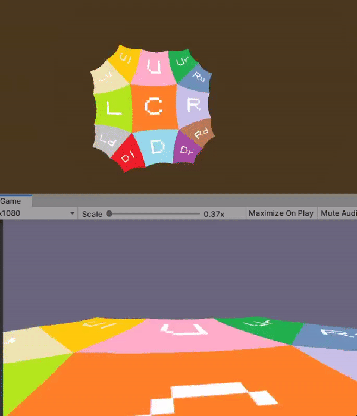

# HyperbolicTileMapping
Extensão da Unity Engine em formato custom package que habilita o Unity a renderizar e mover o Plano Hiperbólico usando tile maps.
[Readme in English](README.md)

## Instalação
Usando o package manager do Unity, selecione: **Add package from git URL** e insira o link:
```
https://github.com/pggkun/HyperbolicTileMapping.git?path=/Assets/Release
```
ou faça download do **.unitypackage** da ultima versão na [página de releases](https://github.com/paulogcosta/HyperbolicTileMapping/releases/tag/1.0.0)

## Uso
Primeiro, crie seus Tile Objects e atribua o prefab do [plano subdividido](https://github.com/paulogcosta/HyperbolicTileMapping/blob/main/Assets/Release/Resources/Prefabs/5SubvidisionSquareTile.prefab) ou um prefab customizado, e atribua uma textura.


Agora crie o Chunk Object  e atribua os Tile Objects que você criou, e mude o campo **ChunkMap** para trocar a posição do seu tile dentro do chunk.


Atualmente podemos usar apenas 13 tiles por chunk seguindo o padrão de mapeamento abaixo, mas você pode extender essa funcionalidade para usar chunk de chunks.


Para renderizar e mover o chunk criado, basta chamar o método público **Initialize** do seu Chunk Object e usar os eixos horizontais e verticais para movimentar.


